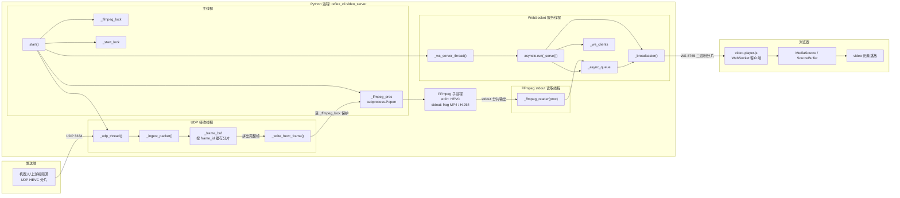

# UDP 包到浏览器播放的线程/对象关系图

本文说明 reflex-cil 图传链路中，从 UDP 分片到浏览器播放的主要对象、线程归属和数据流向。

## 链路说明

1. start() 在模块导入阶段被调用，只负责把整条图传流水线拉起一次。
2. UDP 接收线程监听 3334 端口，调用 _ingest_packet() 按 frame_id 和 slice_id 重组 HEVC 帧。
3. 当某一帧接收完整后，_write_hevc_frame() 把整帧写入 FFmpeg 的 stdin。
4. FFmpeg 把 HEVC 转成浏览器更容易消费的 frag MP4 H.264，并持续写到 stdout。
5. _ffmpeg_reader() 在独立线程中读取 stdout，把分片送入 _async_queue。
6. WebSocket 线程内的 asyncio 事件循环运行 _broadcaster()，把队列中的分片广播给所有浏览器客户端。
7. 浏览器端 video-player.js 通过 WebSocket 接收二进制分片，写入 MSE 的 SourceBuffer，最终驱动 video 元素播放。

## 线程职责

- 主线程：调用 start()，初始化共享对象并启动各工作线程。
- UDP 接收线程：收包、重组帧、把完整帧写给 FFmpeg。
- FFmpeg stdout 读取线程：持续消费 FFmpeg 输出，避免 stdout 管道阻塞。
- WebSocket 服务线程：运行独立 asyncio 循环，负责客户端连接和广播。

## 关键共享对象

- _ffmpeg_proc：保存当前 FFmpeg 子进程句柄。
- _ffmpeg_lock：保护 _ffmpeg_proc 的读取、替换和重启流程，避免并发竞态。
- _frame_buf：缓存未收全的 UDP 分片帧。
- _async_queue：跨线程把 FFmpeg 输出桥接到 asyncio 广播协程。
- _ws_clients：当前连接到视频流的浏览器客户端集合。
- _start_lock：确保 start() 的启动逻辑只执行一次。

